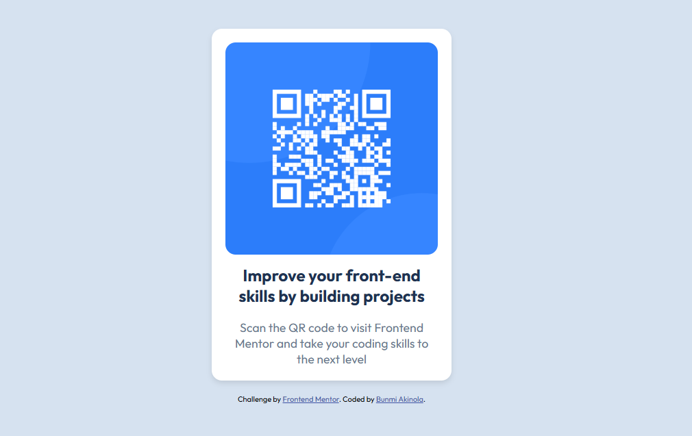

# Frontend Mentor - QR code component solution

This is a solution to the [QR code component challenge on Frontend Mentor](https://www.frontendmentor.io/challenges/qr-code-component-iux_sIO_H). Frontend Mentor challenges help you improve your coding skills by building realistic projects.

## Table of contents

- [Overview](#overview)
  - [Screenshot](#screenshot)
  - [Links](#links)
  - [Built with](#built-with)
- [Author](#author)

## Overview

- A responsive QR code component

### Screenshot

### Links

- Solution URL: [solution URL](https://github.com/bunconice/development/tree/main/qr-code-component)
- Live Site URL: [live site URL](https://qr-code-two-mu.vercel.app/)

### Built with

- Semantic HTML5 markup
- CSS custom properties
- Flexbox
- Mobile-first workflow

## Author

- Frontend Mentor - [@bunconice](https://www.frontendmentor.io/profile/bunconice)
- Twitter - [@bunconice](https://www.twitter.com/bunconice)
